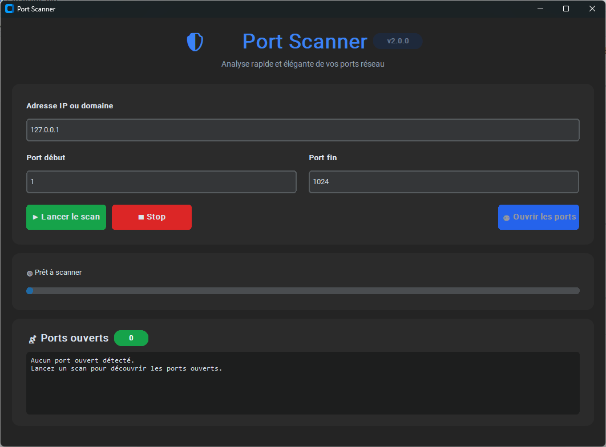

# 🔍 PScan – 1.0.0

**UNIQUEMENT DISPONIBLE EN FRANCAIS POUR LE MOMENT**

**ONLY AVAILABLE IN FRENCH FOR NOW**

Un **scanner de ports simple et rapide**, compilé en `.exe`, permettant de vérifier l’ouverture des ports sur une machine distante ou locale.
Cet outil est conçu pour les administrateurs système, les pentesters légitimes, ainsi que les utilisateurs souhaitant auditer la sécurité de leur réseau.

---

## 🚀 Fonctionnalités

* Scan de ports **TCP**
* Analyse d’un **port unique** ou d’une **plage de ports**
* Résultats affichés en temps réel
* Interface simple et intuitive
* Exécutable Windows **portable** (aucune installation nécessaire)

---

## 📦 Téléchargement (arrive prochainement)

Vous pourrez télécharger la dernière version dans la section **Releases** du dépôt :
👉 *`/releases`*

---

## 🖥️ Utilisation

Exécutez simplement le fichier `.exe`, puis :

1. Indiquez l'adresse IP ou le domaine à scanner.
2. Définissez la plage de ports (1 à 65535).
3. Cliquez sur **Lancer le scan** puis surveillez la progression.

Optionnel :

* Cliquez sur **« Ouvrir les ports »** pour tester les services détectés dans le navigateur.

---

## 🤝 Dépannage
- Si aucun port n'est trouvé, vérifiez que la cible est accessible et que les ports ne sont pas filtrés.
- Pour réduire les faux positifs, évitez de lancer plusieurs scans simultanés sur la même cible.

---

## ⚠️ Avertissement légal

Cet outil est fourni **uniquement à des fins éducatives et d’audit de sécurité légitime**.
N’utilisez **jamais** ce scanner sur un réseau ou une machine sans autorisation explicite.

L’auteur décline toute responsabilité en cas d’usage abusif ou illégal.

---

## ❤️ Contributions

Les contributions sont les bienvenues !
N’hésitez pas à ouvrir une **issue** ou à proposer une **pull request**.

---

## 📄 Licence

Ce projet est distribué sous licence **Mozilla Public License 2.0 (MPL-2.0)**. Consultez le fichier [LICENSE](LICENSE).

Vous êtes libre d’utiliser, copier, distribuer et modifier le code source, **à condition que toute modification apportée aux fichiers existants sous MPL-2.0 soit également publiée sous la même licence**.

Le binaire compilé (`.exe`) peut être distribué sous les termes que vous souhaitez, tant que les parties du code couvertes par la MPL-2.0 restent accessibles conformément à la licence.

Pour plus d’informations, veuillez consulter le texte complet de la licence dans le fichier **LICENSE** du dépôt.

--- 

Basé sur la version de [LUOX](https://github.com/luoxthedev/port-scanner/tree/main)
